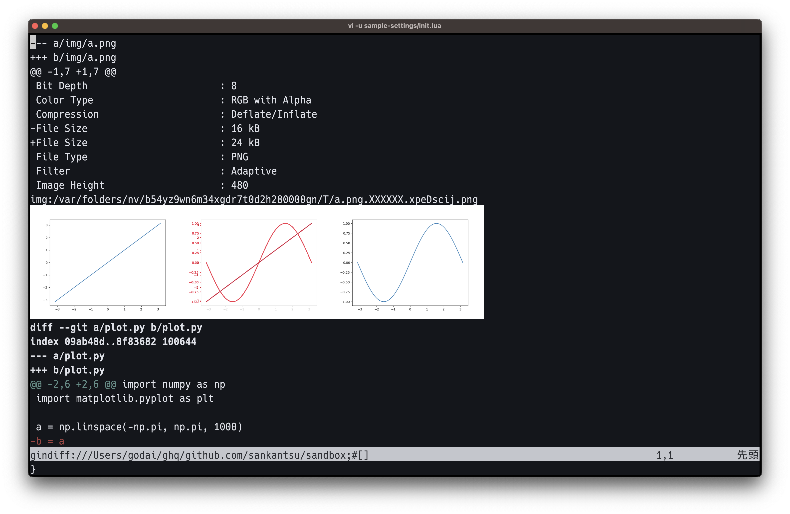

# gin-diff-image.nvim

Show image diffs within Neovim buffer!

This plugin provides `:GinDiff` ([vim-gin](https://github.com/lambdalisue/vim-gin)) integration for [image.nvim](https://github.com/3rd/image.nvim).



## Dependencies

- [git-diff-image (fork)](https://github.com/sankantsu/git-diff-image)
- [vim-gin](https://github.com/lambdalisue/vim-gin)
- [image.nvim](https://github.com/3rd/image.nvim)

## Setup example

Neovim configuration example (`lazy.nvim`).

```lua
-- add luarocks path
-- image.nvim requires `magick` luarock
-- run `luarocks --local --lua-version=5.1 install magick`
package.path = package.path .. ";" .. vim.fn.expand("$HOME") .. "/.luarocks/share/lua/5.1/?/init.lua"
package.path = package.path .. ";" .. vim.fn.expand("$HOME") .. "/.luarocks/share/lua/5.1/?.lua"

require("lazy").setup({
  -- dependencies
  "vim-denops/denops.vim",
  "lambdalisue/vim-gin",
  "3rd/image.nvim",
  -- this plugin
  "sankantsu/gin-diff-image.nvim",
})

require("image").setup({
  integrations = {
    gindiff = {
      enabled = true,  -- enable gin-diff image integration
    },
  },
})
```

NOTE: You also need some gitconfig changes for [git-diff-image (fork)](https://github.com/sankantsu/git-diff-image) (see git-diff-image README).
